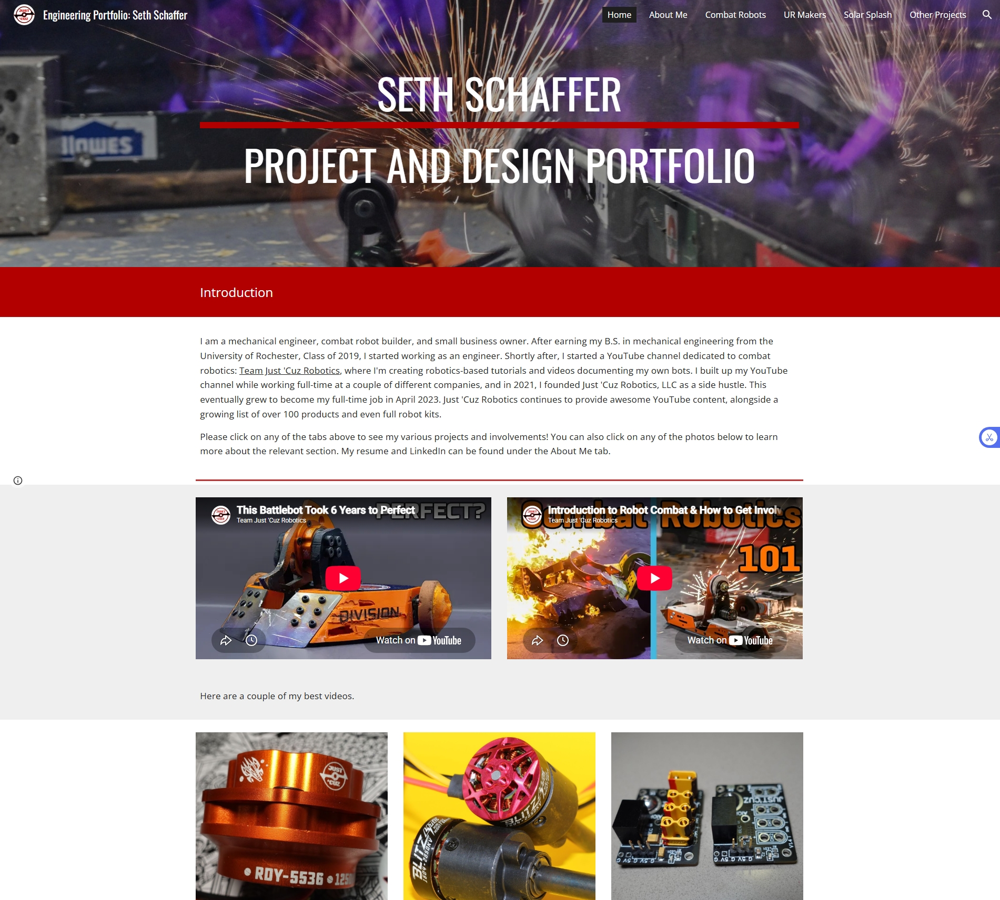
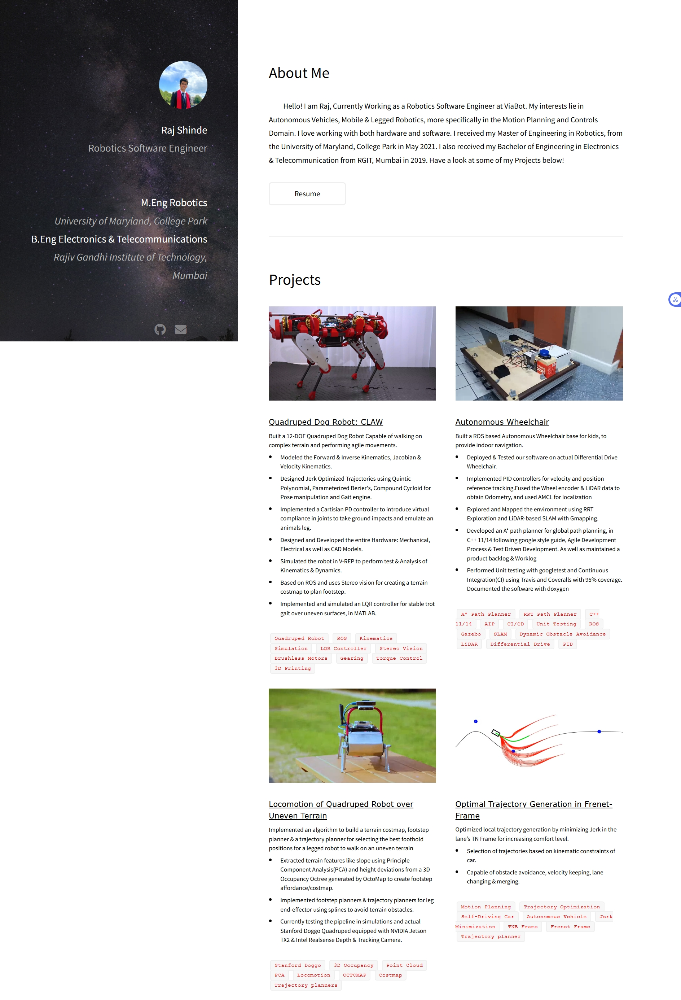

# A1 – Portfolio Creation
## Analyze
https://sites.google.com/view/sethschafferportfolio/home

I looked at a man named Seth’s Portfolio.
His portfolio starts out with about a two hundred word bio about him. Immediately under his bio are his projects. There are some youtube videos embedded underneath the bio and underneath that there are pictures and descriptions. At the very top of the page there is a banner menu which offers a few options. This banner has all of his projects which you can click on and a new page will come up with more detailed descriptions of his projects. The website is easy for anyone to use and is visually pleasing. The Website is reproducible as it is very obvious he made it himself. I find on the surface it didn’t say how decisions were made but in the embedded youtube videos you could learn more. The Tone was professional and this would definitely be employer ready,

https://rajpshinde.github.io/ 

The next one I looked at was from github. This one is from Raj Software Engineer from India with a Masters in Robotics from Maryland. His Bio is nearly less than a hundred words. His page heavily relies on his projects which are below the bio with his resume. I don’t find the side bar on the left attractive since it takes up half the page and does not ever go away. The website is very easy to use but is still dull. The projects are excellent and so they should speak for themselves. The portfolio does show his design process and how decisions were made which is good and the tone is professional as can be.

## Product Analysis

