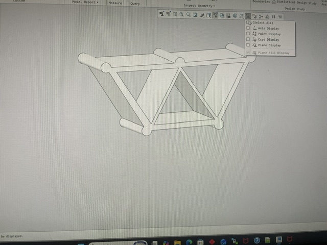

# A2 – Truss Stress Analysis

## Objective

## Analyze

## Decide
_Which geometry did you select, and why? This is your first open design choice in the course — defend it._

## Topic: Likelihood of Failure Modes in Truss Components

## Download
https://drive.google.com/drive/folders/1ESFeaWSr4QqMpWqN5K4x8xtdz4wsImEo?usp=drive_link
## Engineering Lessons
Dont wait till the deadline to do the project because It takes you a long time and ruins your sleep schedule. You also cannont ask questions because you dont have time.
## LikelyHood of failiars in truss structures
If this were to fail It would fail in the middle where shear force is highest on the pins
##
