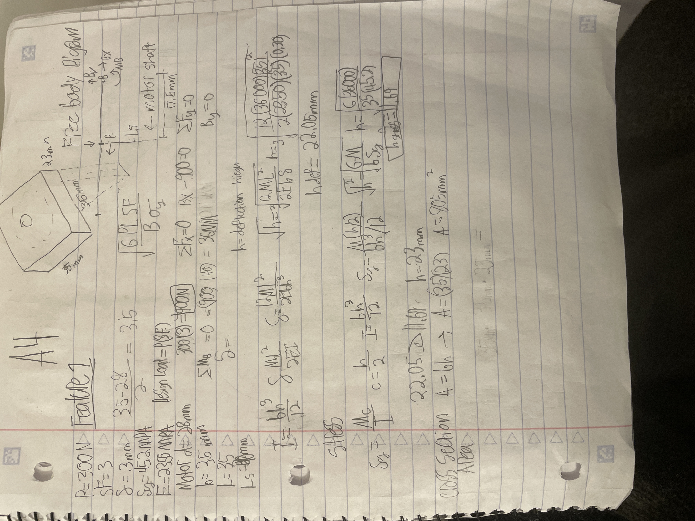
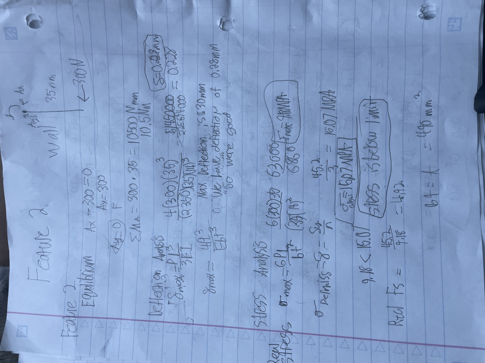

# A4 – Motor Mount
## Objective
Create a Motor mount by calculating the forces to make sure it works with our 3d printer filament. 

I used this Motr diagram above when I created the mount because all the dimensions were necessary to know so that theoretically they would fit together in real life.
## Feature 1
--------------------------------------------------------------------
I chose PETG because that is what I have been using in 3D all semester. Below you will see me use the materials constants to figure out the safe thickness with regards to the shear and the math regarding this choice.

## Feature 2
--------------------------------------------------------------------
I Used force balance first which allowed me to do the stress and deflection math. I basically found the equations plugged the variables in and got my result. With the result I used my logic to decern what the result meant compared to my given and ither calculated values that were the product of a given value and a number I chose for a dimension. 

## Sketch
I created this isometric view which not only helped me create the cad model but I think it also helped me understand the problem better.

## Parametric CAD Model
There should be two very easy ways to access my CAD Model Please Don't complain you cannot access it and give me a zero Because that is not true click the link to the shared Google Drive and the park Is called motormount.prt. When I made this part I started with some rectangle extrudes and created an L shape. The next thing I did was I measured out a reassessment for the motor head. After that I drilled the holes for the motor to bold into that and then finally I drilled the holes for the motor mount to be able to bold on whatever we want. PS. If the file does not open check your Creo version It does not always work for me across all versions of creo. MY model should be from CreO 12.4.
https://drive.google.com/drive/folders/1ESFeaWSr4QqMpWqN5K4x8xtdz4wsImEo?usp=drive_link
[Download Creo Part](./motormount.prt.1)

## Drawing
Here is my drawing I hope you love it aso much as I do. Dont mind the template I did not have time to switch back to the UNCC template because I could not find it on my PC.

## Lessons Learned
This Assignment took 12 hours honestly; I should switch majors and It is not because this major is to hard but I think it is because this specific class is obnoxiously difficult it a way that is a dis service to its students. I hate working on these dumb assignments. I would say oh I should start working on them earlier but that would not be a good fair statement. I work on these projects when I have time and there really is not a time that you can find to complete something like this to and degree of completion that is satisfactory when You have 30hours of class on campus plus doing work for other classes. This is why the Graduation Rate is so low.

