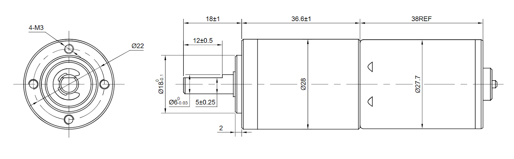
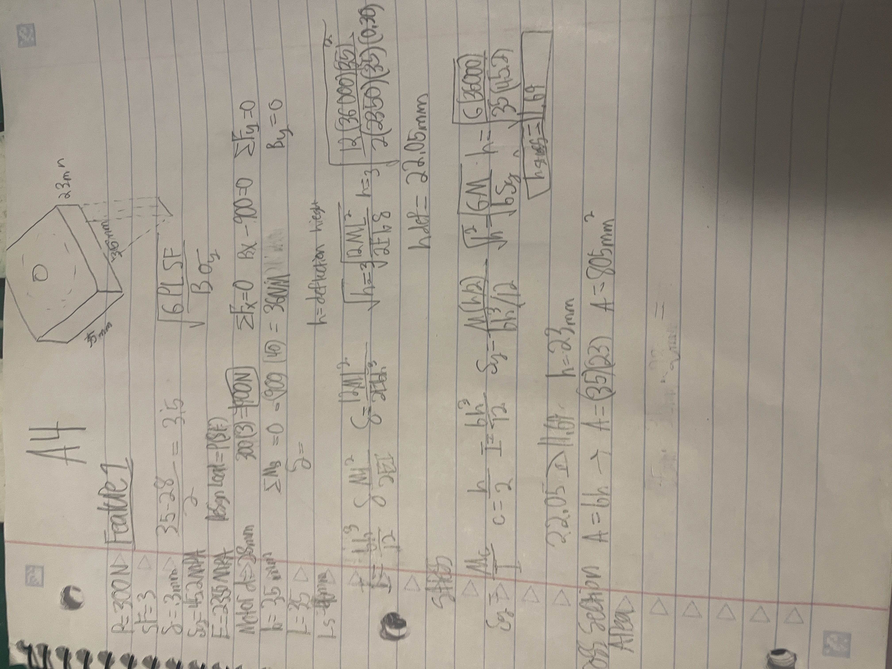
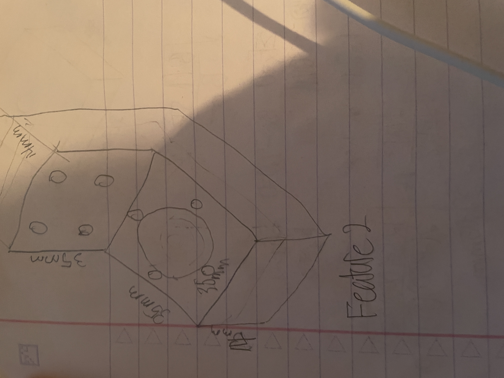
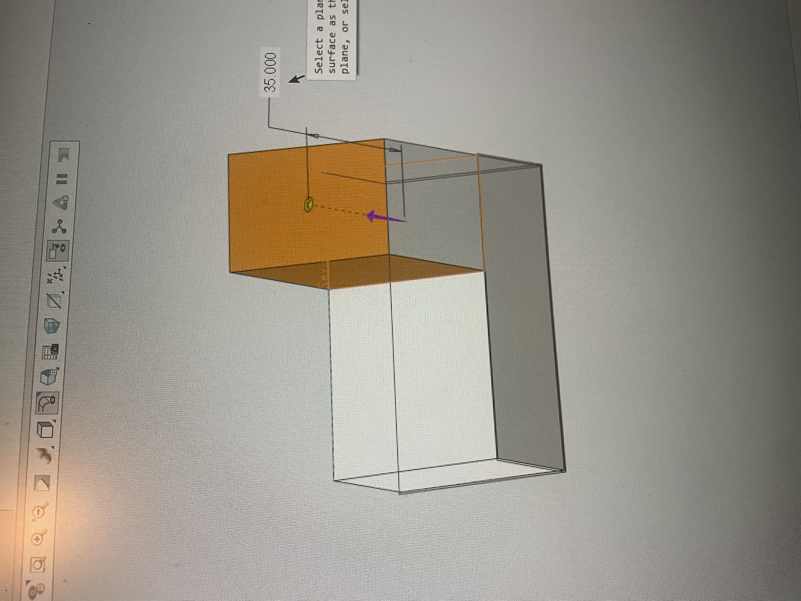
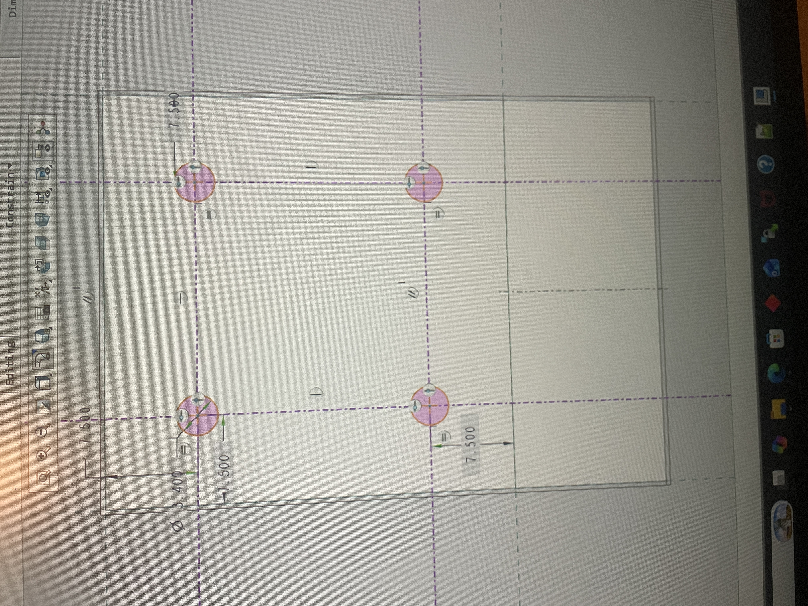
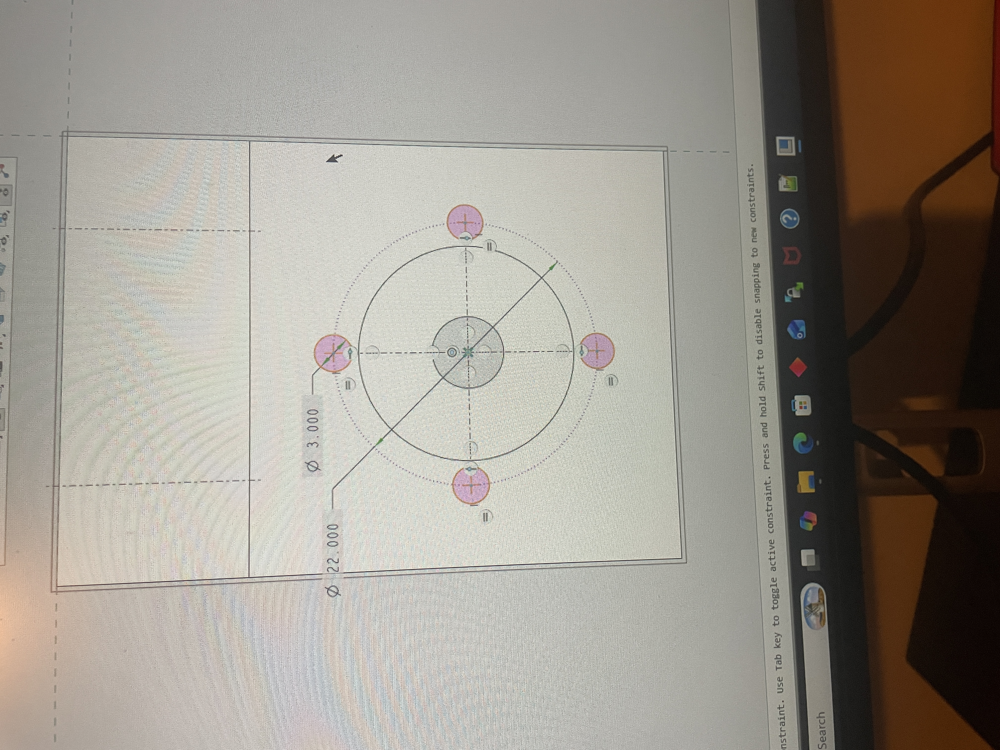
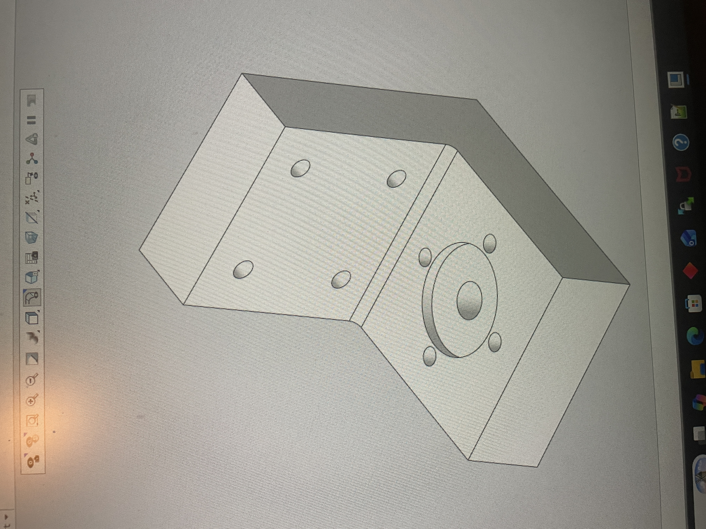
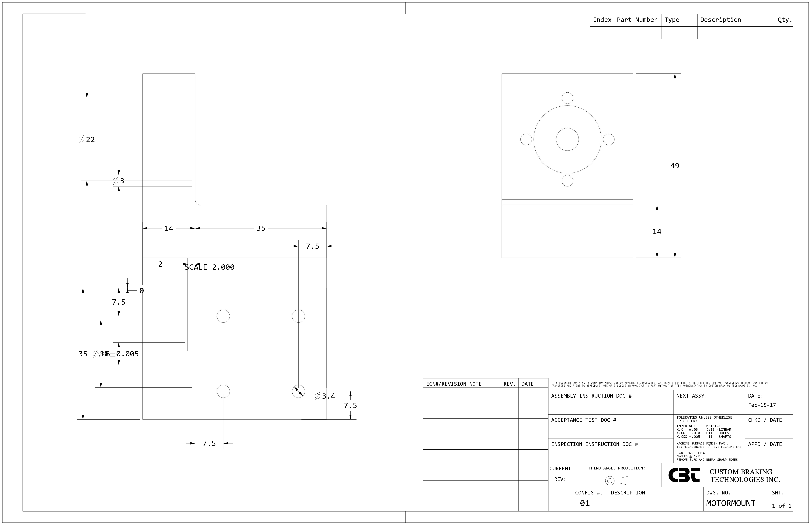

# A4 – Motor Mount
## Objective
Create a Motor mount by calculating the forces to make sure it works with our 3d printer filament.

## Feature 1
--------------------------------------------------------------------
I chose PETG because that is what I have been using in 3D all semester. Below you will see me use the materials constants to figure out the safe thickness with regards to the shear and the math regarding this choice.

## Feature 2
--------------------------------------------------------------------
## Sketch

## Parametric CAD Model
https://drive.google.com/drive/folders/1ESFeaWSr4QqMpWqN5K4x8xtdz4wsImEo?usp=drive_link
[Download Creo Part](./motormount.prt.1)

## Drawing
Here is my drawing I hope you love it aso much as I do. Dont mind the template I did not have time to switch back to the UNCC template because I could not find it on my PC.

## Lessons Learned
This Assignment took 12 hours honestly; I should switch majors and It is not because this major is to hard but I think it is because this specific class is obnoxiously difficult it a way that is a dis service to its students. I hate working on these dumb assignments. I would say oh I should start working on them earlier but that would not be a good fair statement. I work on these projects when I have time and there really is not a time that you can find to complete something like this to and degree of completion that is satisfactory when You have 30hours of class on campus plus doing work for other classes. This is why the Graduation Rate is so low.

