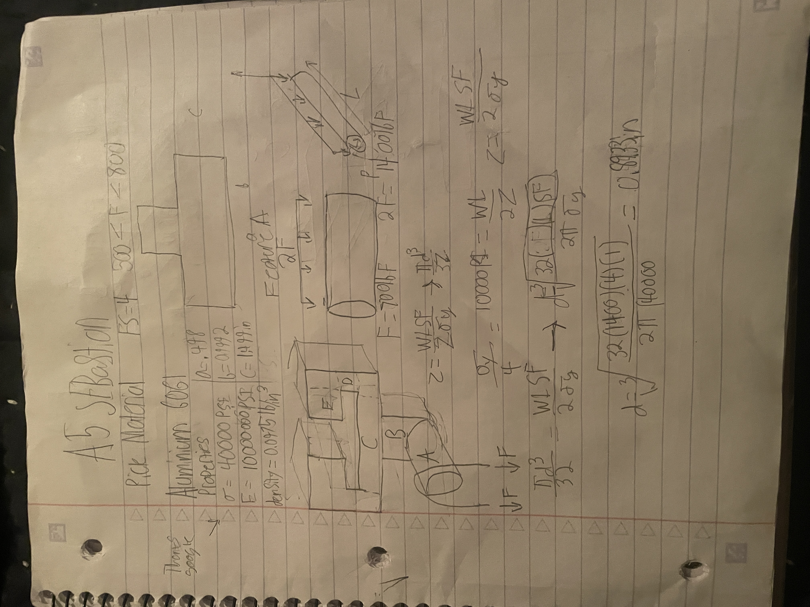
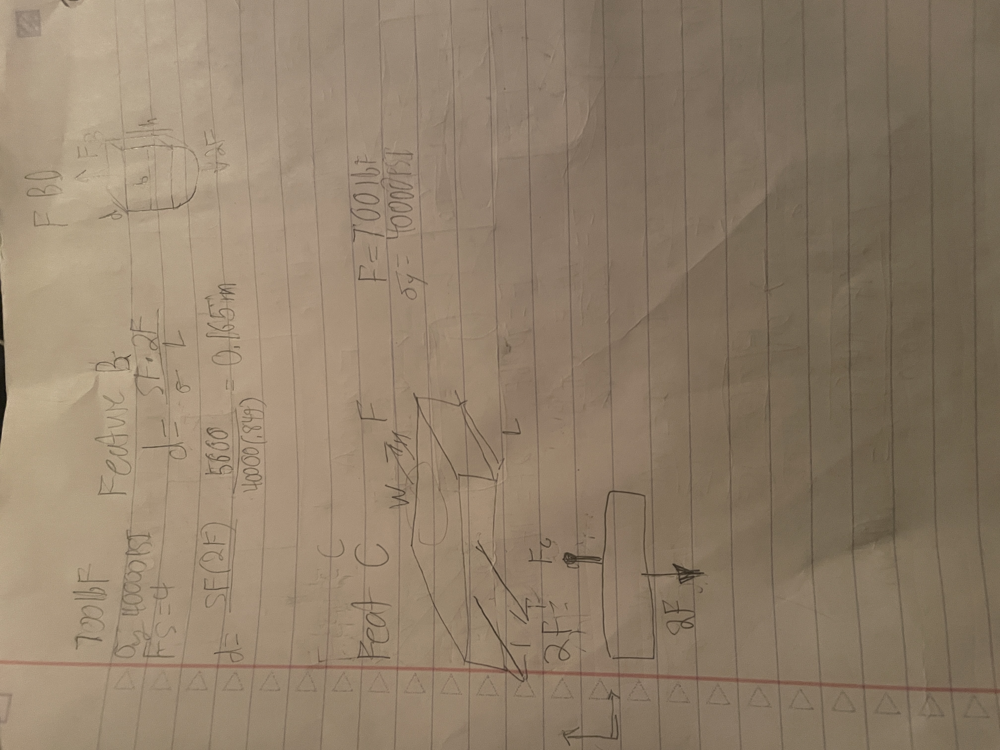
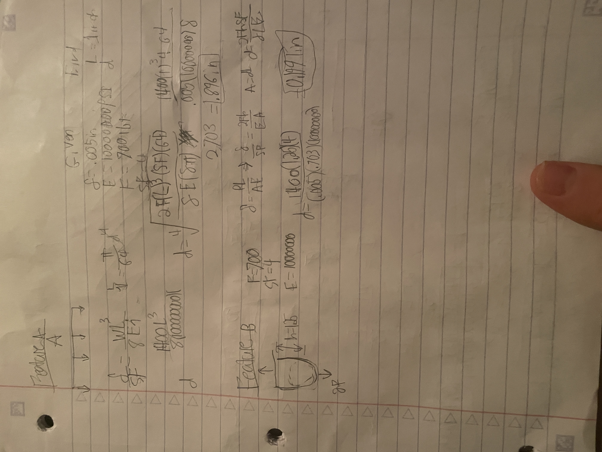
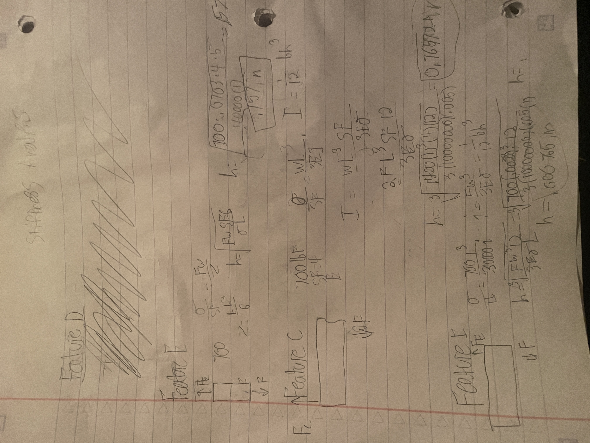
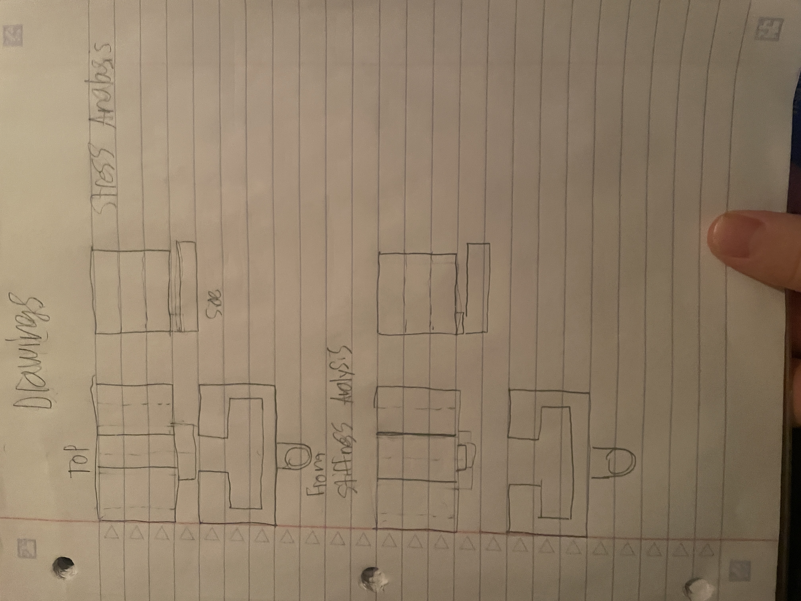

# A5 – Bracket Design

-----------------------------------------------------------------------------------------------------

## Calculating Dimensions from Stress Analysis
The stress analysis made me take some of our equations and almost all of our givens and combine the two for some of the components of our hangar. For each of the features I used the photo that was provided that separated out each one of the features then I took them and studied the geometry where I made a free body diagram. This free body diagram helped my model the equations I made. 

## Calculating Dimensions from Stiffness Analysis
the stiffness analysis was a bit simpler since I already had done the Stress analysis and had some demensions

## Generate Multiview Sketches
The sketches I drew look nearly identical and they should because not much changes with 1400 lbF of load hanging doen form the loop.

### Lessons Learned
When working on this I hated it. I would suggest I quit engineering school because Dr Fagans class is to much. It also annoys me that there is this every week. What it did learn was how to calccute many different things for somthing that I have designed.

