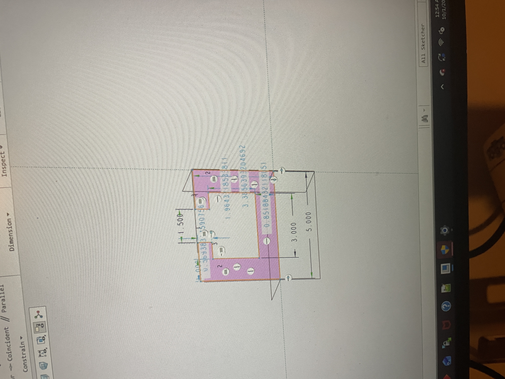
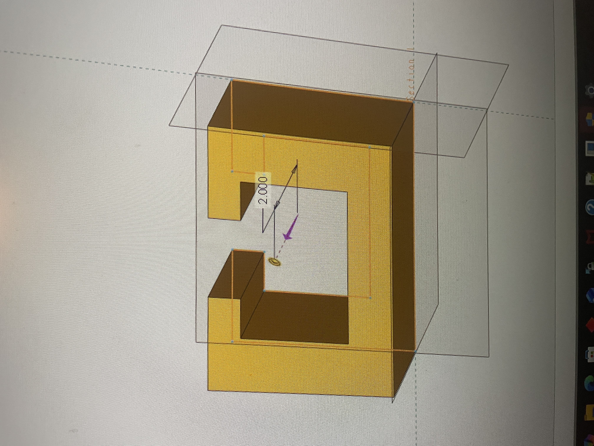
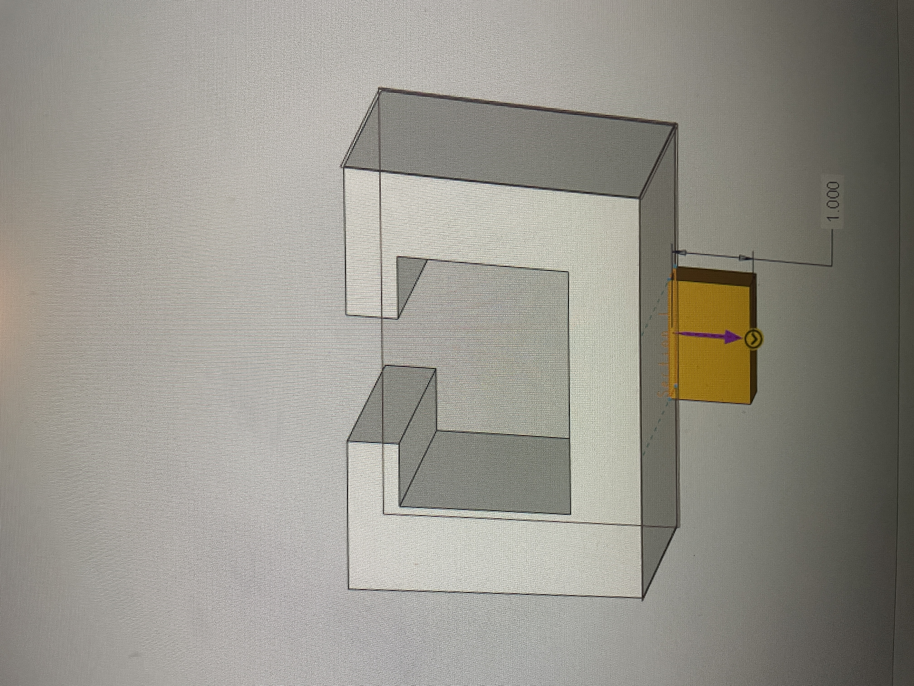
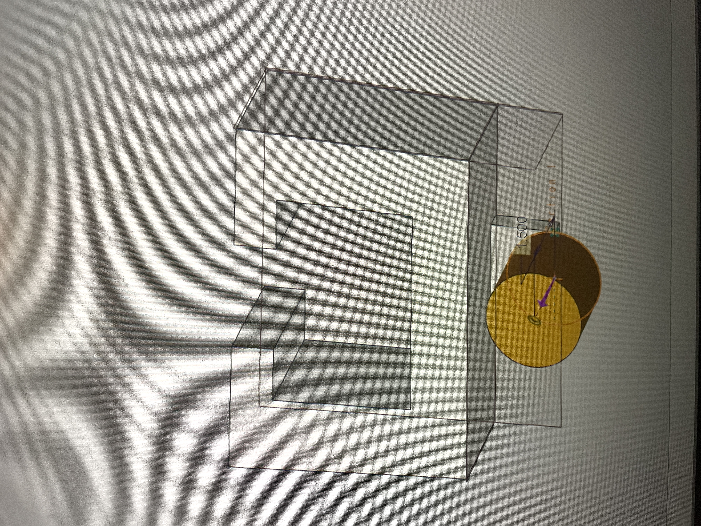
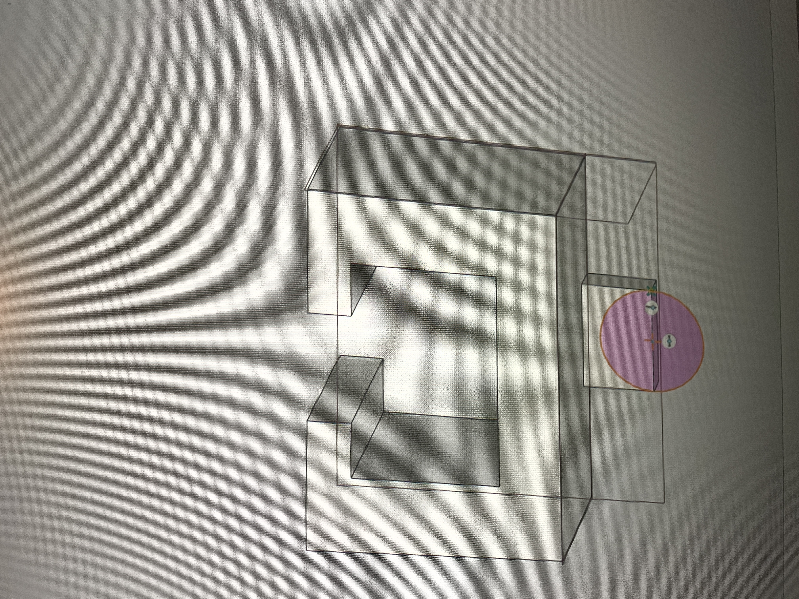
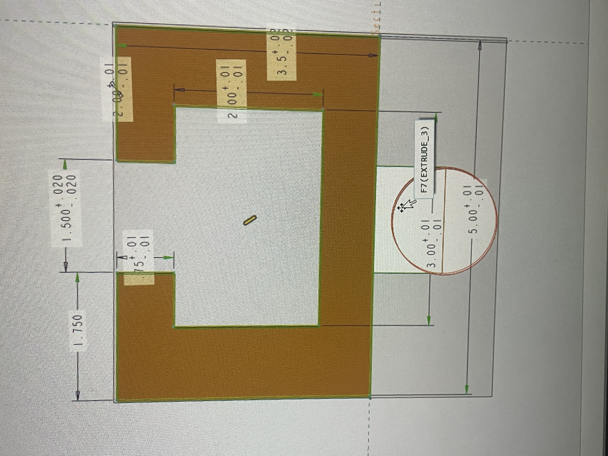
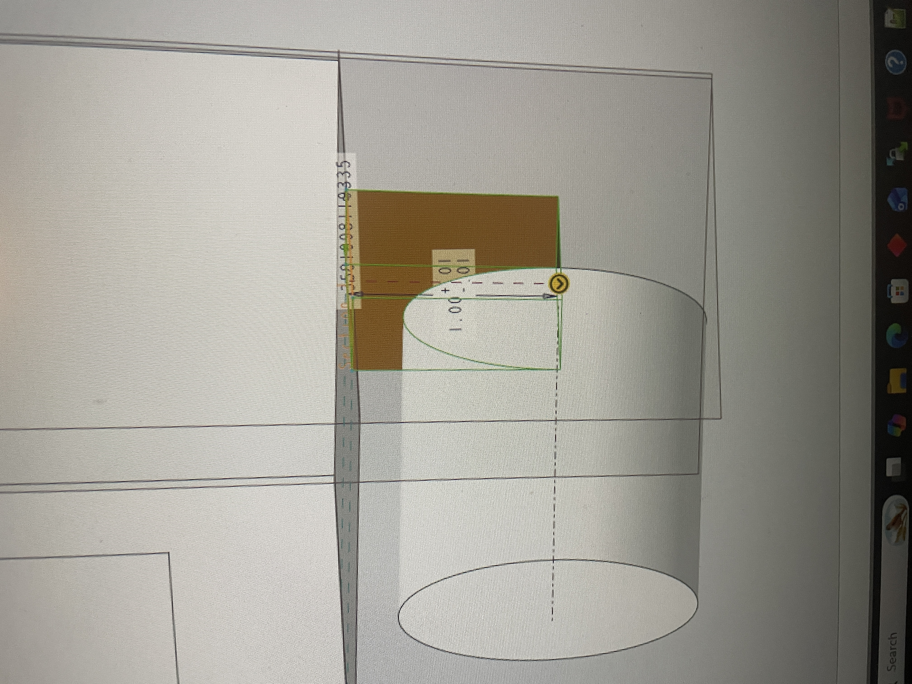
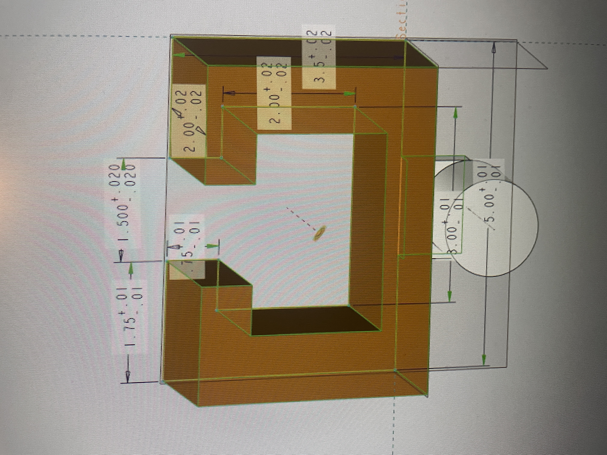
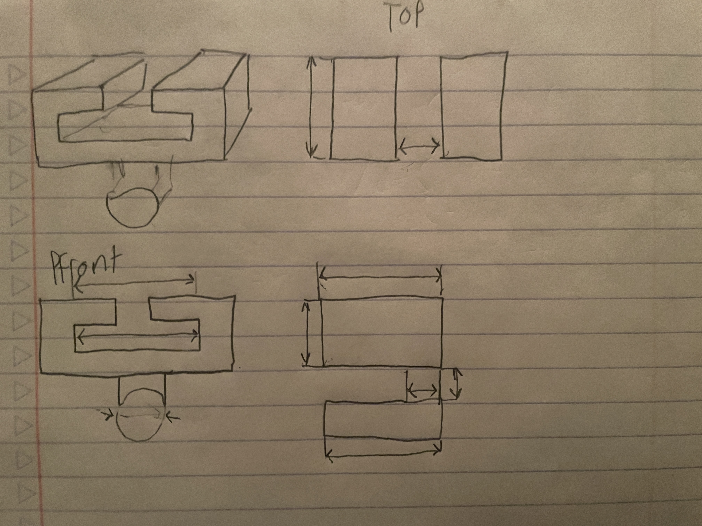

# A6 – Bracket Drawing (Drawings Part 1)

Create a solid model of the link in CAD, parametrically tied to the bracket dimensions where appropriate.
Show the parametric table that controls the link dimensions and how they relate to the bracket interface.
Clearly document key design choices made.

## Parametric Design

Produce a multi-view CAD drawing of the link with complete dimensioning and proper tolerancing. 
Apply ASME Y14.5 standards for geometric dimensioning and tolerancing (GD&T).
Include the following:
Third-angle projection layout.
Tolerance block consistent with course standards:
X.X ± .02
X.XX ± .01
X.XXX ± .005
At least two callouts for different tolerancing applied to critical features.
A note identifying the interface features between the link and the bracket.

## Reflections

The assignment tested my patience, but I pulled through. I learned how the dimension for

