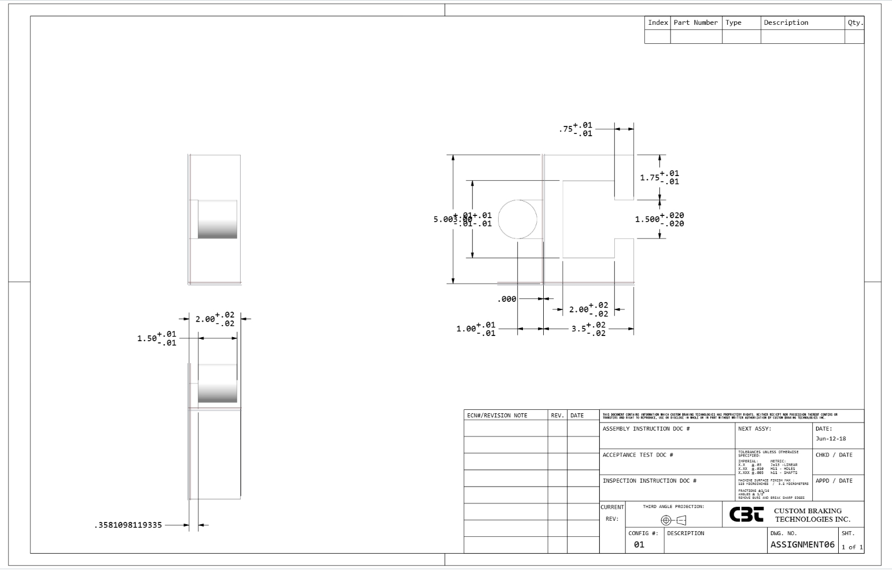

# A6 – Bracket Drawing (Drawings Part 1)

I made my part in Creo and extruded each part step by step as well as dimensioning from A5. I chose to extrude the main body as one piece instead of just a rectangle and cutting through the middle with another geometry. I think this was a good design choice because it made demnsioning easy  and gave me more practice with using the constraints which was good becasue It is a weakness I have in ceo.

## Parametric Design

Produce a multi-view CAD drawing of the link with complete dimensioning and proper tolerancing. 
Apply ASME Y14.5 standards for geometric dimensioning and tolerancing (GD&T).
Include the following:
Third-angle projection layout.
Tolerance block consistent with course standards:
X.X ± .02
X.XX ± .01
X.XXX ± .005
At least two callouts for different tolerancing applied to critical features.
A note identifying the interface features between the link and the bracket.

## Reflections

The assignment tested my patience, but I pulled through. I learned how the dimension for the tolerances of a fit. this took me 5 hours to complete start to finish.

